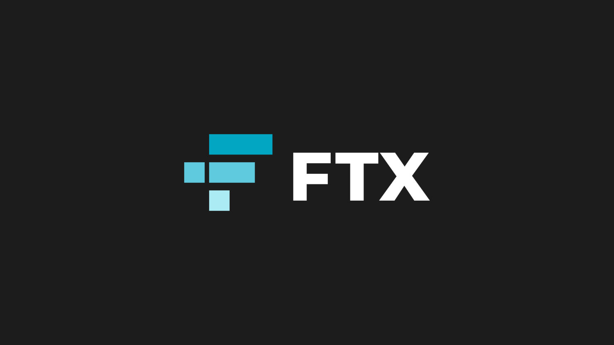

# FTX-Trading Case Study

(https://www.bloomberg.com/news/articles/2021-08-31/ftx-acquires-the-first-u-s-approved-crypto-derivatives-platform)
## Overview and Origin
* What is the name of your company?
  - **FTX Trading Limited**
* When was the company Incorporated?
  - **FTX Exchange was incorporated in 2019**
* Who are the founders of the company?
  - **FTX was founded by Sam Bankman-Fried. Bankman-Fried was a graduate of MIT and a former Wall Street ETF Trader.**

(https://markets.businessinsider.com/news/currencies/ftx-us-buys-ledgerx-crypto-derivatives-exchange-sam-bankman-fried-2021-08)
* How did the idea for the company come about?
  - **Bankman-Fried created FTX trading because he wanted to create a trading platform robust enough for professional trading firms as well as intiuative enough for first-time users.**
* How is the company funded? How much funding have they recieved?
  - **FTX is funded by a multitude of investors with over 60 venture capital firms having a portion of ownership in the company. FTX has recieved over $2 billion in funding and is valued at over $18 billion.**
## Business Activities
* what specific financial problem is the company or project trying to solve?
  - **FTX is trying to be the number one brokerage choice for crypto trading. Its goal is to be used by high level trading firms as well as people just getting into the crypto space.**
* Who is  the company's intended customer? Is there any information about the market size of this set of customers?
  - **As stated previously FTX's intended customer is anyone who is looking to trade cryptocurrencies. As cryptocurrency is a relatively new exchanged asset the market size has a lot of room to grow.** 
* Which technologies are they currently using, and how are they implementing them? (might be tough to find)
  - **FTX is leading the industry in innovation as they are the first cryptocurency exchange to allow the trading of derivatives, options, volatility products and leverage tokens.**
## Landscape:
* What domain of the financial industry is the company in?
  - **FTX is in the cryptocurrency exchange domain. It is also somewhat in the commodities industry. It is in the commodities industry due to the fact that the US Commodity FUtures Trading Commission declared all crypto assets as commodites.**  
* What have been the major trends and innovations of this domain over the last 5-10 years?
  - **The major innovation in this domain is the easing of the barrier for entry. When Bitcoin first started it was very hard for the average person to invest in the asset. Now anyone with a smartphone can invest into a multitude of crypto-assets.**
* What are the other major companies in this domain?
  - **Other major companies in the same domain as FTX include, Coinbase, Kraken, Binance, and Robinhood to name a few.**
## Results
* What has been the business impact of this company so far
  - **FTX is a relatively new Cryptobroker as it has only been around for a little over three years. Yet it has had a major impact in the cryptocurrency space as it is in the top 10 of crypto brokers when it comes to daily trading volume. Going forward many analysts believe it will be in the top five in the near future due to its ease of use and advanced layout.**
* What are some of the core metrics that companies in this domain use to measure success? How is this company performaning based on metrics
  - **The big metrics when it comes to measure sucess for crypto exchanges is the amount of daily volume seen on the platform as well as the average amount of users. As for where FTX stacks up, they are number nine when it comes to daily volume seen on their platform. As for the amount of registered users, FTX has over 1.5 million users and growing. This places them in the top ten for the amount of registered users compared to their competitors.**
* How is your company performing relative to competitors in the same domain?
  - **As FTX is such a new company they are one of the major up and comers in the crypto space. They are growing rapidly due their great user interface on the platform as well as their strong approach to advertising and partnerships. They have recently made major ad partnerships with many major figures and  businesses in the sporting world. These deals include but are not limited to, Tom Brady, Steph Curry, Barstool Sports, and even the organization of Major League Baseball as a whole. Due to their agressiveness in getting their brand out to the masses they could see a great influx in users and volume in quarter 4.**
## Recommendations
* If you were to advise the company, what products or services would you suggest they offer?
  - **A potential product I think FTX should think about producing is a hardware crypto wallet. A hardware wallet is a device where individuals can store there cryptocurrencies off of exchanges and into their own personal wallet. This is for increase security of their cryptoassets.**
* Why do you think that offering this prodcut or service would benefit the company?
  - **The main reason why I think this product would benefit them is because their is a small amount of competitors in this space and FTX could potentially take up a good chunk of that marketshare.**
* What technologies would this additonal product or service utilize?
  - **The main technology that this product uses is the benefits of blockchain and its advanced security. When someone creates a cryptowallet they have a public key which is available to see on the blockchain, and a private key which only the owner knows. It is virtually impossible for a hacker to gain acess to someone's crypto assets if they do not know the personalized private key.**
* Why are these technologies appropriate for your solution?
  - **If FTX were to offer a hardware wallet for purchase it would potentially lower the amount of cryptoassets on their exchange. Yet due to their offering of a superior hardware wallet I believe it would draw more credibility to the company as well as draw in more big time users to their platform. Crypto users who truly believe in Bitcoin and DeFi are big advocates of users owing their own keys. With the addition of easily available cold storgage from FTX, I believe FTX would have a big backing from some of the biggest crypto influencer's in the space.**
  ## Addendum (Sources)
https://ftx.com
https://www.forbes.com/sites/stevenehrlich/2021/08/31/us-bitcoin-exchange-backed-by-billionaire-sam-bankman-fried-moves-into-crypto-derivatives/?sh=55585abf4022
https://fortune.com/2021/09/16/crypto-companies-derivatives-trading-regulation-salt-conference/
https://www.bloomberg.com/news/articles/2021-08-31/ftx-acquires-the-first-u-s-approved-crypto-derivatives-platform
https://www.fool.com/investing/2021/09/02/heres-why-cryptocurrency-ftx-is-soaring-today/